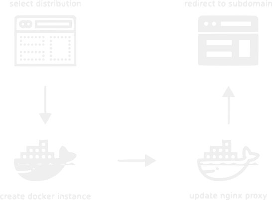

## Using Docker to create a Paas


<!-- #### [Meetup XXX](https://www.meetup.com/XXX) -->

### www.distros.bid

###### [TheodorosPloumis.com](http://www.theodorosploumis.com/en) / [@theoploumis](http://twitter.com/theoploumis)
________________________

###### Get them: [online presentation](http://theodorosploumis.github.io/docker-paas) / [source code](https://github.com/theodorosploumis/docker-paas)

###### Under [Attribution 4.0 International](http://creativecommons.org/licenses/by/4.0/) license. Icons by [icons8](https://icons8.com).

---

### What is this talk about

- About Paas and software
- System infrastructure
- Technical details
- Alternative methods
- Tips and issues
- Similar projects

---

### Online Paas

- Simple public website
- Every visitor can try a Drupal distribution
- Every instance runs on docker
- Every instance matches a subdomain
- Instances run for 40min
- Admin monitors the docker containers


---

### Software

- server/apache2/php
- docker/docker hub
- reverse proxy
- git/github
- bash script
- Portainer

Get the [source code](https://github.com/theodorosploumis/drupal-docker-distros)

---

### Server flow diagram



---

### Docker images

- [drupal8/distros](https://hub.docker.com/r/drupal8/distros/tags)
- [jwilder/nginx-proxy](https://hub.docker.com/r/jwilder/nginx-proxy)
- [portainer/portainer](https://hub.docker.com/r/portainer/portainer)


---

### Main tasks

```
docker create -e VIRTUAL_HOST=foo.bar.com ...

docker run ...

"http redirect with delay"

docker kill && docker rm ...

```

See the code [here](https://github.com/theodorosploumis/drupal-docker-distros/blob/master/html/container.php).

---

### Alternative methods

- Virtualhost
- Docker web UI per user

---

### Tips

- [Server tasks automation](https://github.com/theodorosploumis/drupal-docker-distros/blob/master/scripts/server-install.sh)
- [Spam protection](https://www.google.com/recaptcha)
- [Docker tags](https://hub.docker.com/r/drupal8/distros/tags) vs images
- Disable docker hub automated builds
- [docker sdk](https://github.com/theodorosploumis/drupal-docker-distros/issues/1) vs 'php exec'
- Add [Swap space](https://www.digitalocean.com/community/tutorials/how-to-add-swap-space-on-ubuntu-16-04)
- Use docker-compose

---

### Future plans

- Member accounts
- Permanent sites
- Use mysql as a docker container
- Ansible provisioning
- ...

See the [plan](https://github.com/theodorosploumis/drupal-docker-distros/issues/2)

---

### Similar projects

- Command as a service. Eg [Faast](https://faaast.download)
- Simple chat. Eg [Let's chat](https://hub.docker.com/r/sdelements/lets-chat)
- Online training. Eg [play with docker](https://training.play-with-docker.com)
- Online IDE. Eg [Codenvy](https://codenvy.com)
- Serverless functions. Eg [OpenFaaS](https://www.openfaas.com)

---

### Demo

- [Public website](https://www.distros.bid)
- Portainer dashboard (port 9988)

---


#### Questions?
